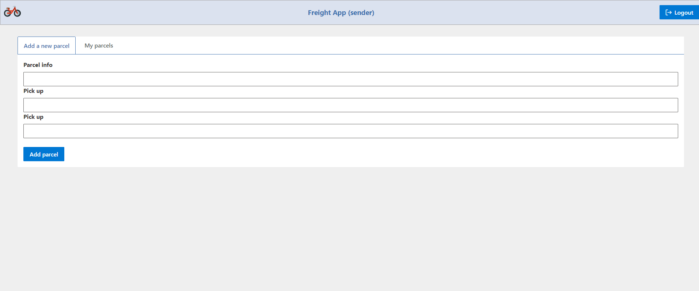
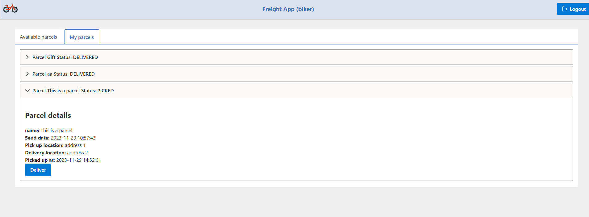

# Welcome to Saloodo Front-End

Hello there! 👋 Welcome to the front-end section of Saloodo. I am excited to show you my work

## Introduction

In this section I will explain how to use the front end part of the app.

## Usage

### The landing page

After opening the application you will find this landing page in front of you.

You can start using the application from here

To use either the sender or the rider dashboards you need to press the **Login** button on the top right corner of the page

a popover will appear for you to write the user name and password

there are built in user names and passwords for you to use

there are 10 sender accounts all with the same password

the user names are:

- sender1
- sender2
- sender3
- sender4
- sender5
- sender6
- sender7
- sender8
- sender9
- sender10

and the password is  **123**  for all accounts

as for the bikers there are 5 accounts and all of them also have the same pass word

the usernames are

- biker1
- biker2
- biker3
- biker4
- biker5

and the password is also  **123**  for all accounts

### The sender dashboard

The sender dashboard has 2 tabs one to add a new parcel and one to see current parcels

You can add a new package by simply filling the form data and pressing on the add parcel button

You can find your parcels in the My Parcels tab

You can find that the new parcel was added and it is waiting for some one to pick it up

You can see the current state of the parcel when the a picker takes it or delivers it.

### the biker dash board

The biker dashboard also have 2 tabs

one tab is for the un-assigned parcels and the other tab is for the parcels assigned to this specific rider

to take a parcel you have to click on the Assign button.

it will disappear from the new parcels table and it will appear in the ***My parcels*** tab

To show that the biker has delivered the packer the biker has to click on the Deliver button

---

That is it !

Enjoy testing the app 